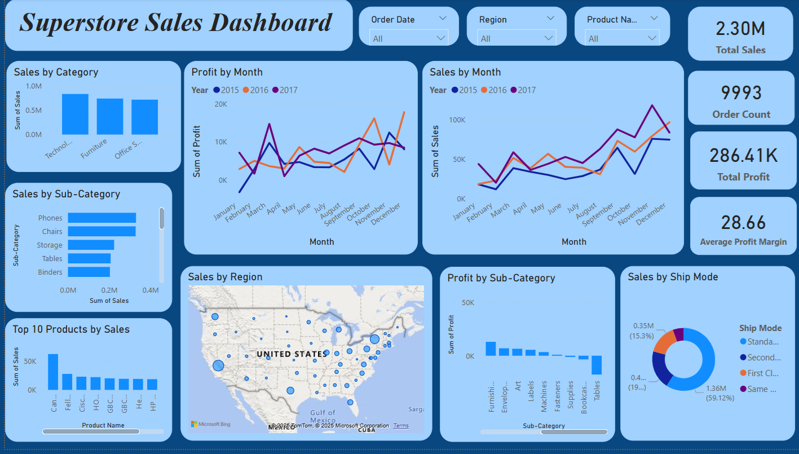

📊 Superstore Sales & Profit Dashboard (Power BI)
This repository contains a professional Power BI dashboard that analyzes sales, profit, discounts, and regional performance for a global superstore. The dashboard is built using a cleaned version of the popular Superstore dataset.

📁 Project Structure
File	Description
Cleaned_Superstore.csv	Cleaned and enhanced version of the dataset
Sample_superstore_dashboard.pbix	Power BI dashboard file
Sample - Superstore.csv	Original raw data (before cleaning)
README.md	Project documentation

🧼 Data Cleaning Summary
Performed using Python (Pandas) before import to Power BI:

Removed unnecessary columns (e.g., Row ID, Country)

Converted Order Date and Ship Date to datetime

Removed duplicates and rows with missing key values

Created additional columns:

Year, Month

Profit Margin

Sales Bucket (Low, Medium, High, Very High)

📊 Dashboard Features
The Power BI dashboard includes:

📌 KPI Cards: Total Sales, Total Profit, Total Orders, Avg. Profit Margin

📈 Sales Trend (Line Chart)

📦 Sales by Category and Profit by Sub-Category (Bar Charts)

🗺️ Regional Sales (Map)

📉 Discount vs Profit Analysis (Scatter Plot)

🔎 Filter Slicers: Year, Region, Segment, Category

🧠 Insight Panel with key findings

💡 Insights
Technology leads in revenue generation

Copiers are the most profitable sub-category

Discounts >20% often lead to negative profit

Central region underperforms in terms of profitability

## 📷 Dashboard Preview

📌 Tools Used
Power BI Desktop

Python (for preprocessing with Pandas)

Microsoft Excel (minor inspection)